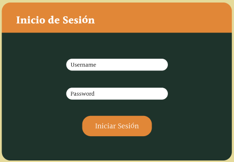
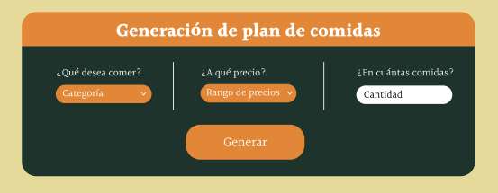
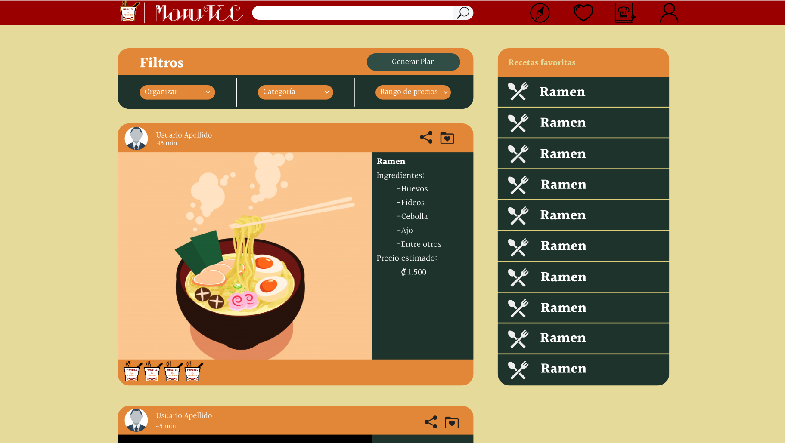

This project was bootstrapped with [Create React App](https://github.com/facebook/create-react-app).

## Available Scripts

In the project directory, you can run:

### `npm start`

Runs the app in the development mode. 
Open [http://localhost:3000](http://localhost:3000) to view it in the browser.

The page will reload if you make edits. 
You will also see any lint errors in the console.

### `npm test`

Launches the test runner in the interactive watch mode. 
See the section about [running tests](https://facebook.github.io/create-react-app/docs/running-tests) for more information.

### `npm run build`

Builds the app for production to the `build` folder. 
It correctly bundles React in production mode and optimizes the build for the best performance.

The build is minified and the filenames include the hashes. 
Your app is ready to be deployed!

See the section about [deployment](https://facebook.github.io/create-react-app/docs/deployment) for more information.

### `npm run eject`

**Note: this is a one-way operation. Once you `eject`, you can’t go back!**

If you aren’t satisfied with the build tool and configuration choices, you can `eject` at any time. This command will remove the single build dependency from your project.

Instead, it will copy all the configuration files and the transitive dependencies (Webpack, Babel, ESLint, etc) right into your project so you have full control over them. All of the commands except `eject` will still work, but they will point to the copied scripts so you can tweak them. At this point you’re on your own.

You don’t have to ever use `eject`. The curated feature set is suitable for small and middle deployments, and you shouldn’t feel obligated to use this feature. However we understand that this tool wouldn’t be useful if you couldn’t customize it when you are ready for it.

## Learn More

You can learn more in the [Create React App documentation](https://facebook.github.io/create-react-app/docs/getting-started).

To learn React, check out the [React documentation](https://reactjs.org/).

### Code Splitting

This section has moved here: https://facebook.github.io/create-react-app/docs/code-splitting

### Analyzing the Bundle Size

This section has moved here: https://facebook.github.io/create-react-app/docs/analyzing-the-bundle-size

### Making a Progressive Web App

This section has moved here: https://facebook.github.io/create-react-app/docs/making-a-progressive-web-app

### Advanced Configuration

This section has moved here: https://facebook.github.io/create-react-app/docs/advanced-configuration

### Deployment

This section has moved here: https://facebook.github.io/create-react-app/docs/deployment

### `npm run build` fails to minify

This section has moved here: https://facebook.github.io/create-react-app/docs/troubleshooting#npm-run-build-fails-to-minify

# Lista de Funcionalidades Ofrecidas

Para el desarrollo del proyecto se propusieron una serie de requerimientos funcionales. A continuación, se dará una explicación detallada de cada uno de ellos.

## Registro de nuevos usuarios

Los nuevos usuarios de la aplicación, que no poseen una cuenta en El Foráneo deberán llenar el formulario de creación de nuevas cuentas, en el cual el usuario debe ingresar datos personales, los cuales son:

* Nombre

* Apellidos

* Correo electrónico

* Username

* Contraseña

	Con dicha información suministrada, el usuario dará click al botón "Regístrate" y el sistema se encargará de validar que no exista otro usuario con dicho correo o username, y en dicho caso registrará al nuevo usuario.

	A continuación se presenta como, según el prototipo realizado del sistema el Foráneo, se visualizará dicho apartado:

Figura 1

## Iniciar Sesión

Los usuarios al iniciar sesión deberán suministrar su username y contraseña con el objetivo de poder acceder a su cuenta. En caso de que los datos no sean correctos, el sistema desplegará un mensaje indicando al usuario la condición.

La siguiente imagen presenta como se verá dicho apartado en la aplicación:

Figura 2

## Ingresar recetas

Una vez ingresado los usuarios, estos podrán subir sus recetas personalizadas.  Para esto el usuario deberá ingresar datos como el nombre de la receta, tiempo estimado, ingredientes, pasos para la elaboración, así como una imagen de la receta. Una vez listo los datos, se dará en agregar receta y está será ingresada al sistema, donde podrá ser vista por los demás usuarios, así como compartida y añadida a favoritos.  La siguiente imagen, muestra cómo ha sido diseñado este apartado en el prototipo.

Figura 3

## Guardar y compartir recetas

Si el usuario ve una receta que le llama la atención, podrá guardar en la sección de favoritos, para después encontrarla de una manera más rápida. Además de esto, tendrá la opción de compartirla en su propio muro, para que los demás usuarios que lo siguen, puedan observar la receta también. Dichas funcionalidades se realizarán mediante los siguientes botones.

Figura 4

## Calificar recetas

Cuando usted ve una receta, está tendrá la opción de calificarla. Cada receta podrá tener puntuación de 1 a 5. El sistema de calificación será representado por el logo de la aplicación, y tendrá un comportamiento igual a la calificación con estrellas. La puntuación se verá reflejada en la parte inferior izquierda de la receta y será el promedio de calificación de todos los usuarios. Cada usuario puede calificar la receta según así lo convenga. Este sistema de calificación ayudará al usuario a ver la calidad de la receta, (según la opinión de los demás usuarios), así como en la búsqueda de nuevas recetas, donde se podrá filtrar por este aspecto. En la siguiente imagen, podemos ver que esta receta está calificada con una puntuación de 5.

Figura 5

## Búsqueda y filtrado de recetas 

Los usuarios de la aplicación web El Foráneo podrán realizar búsquedas de recetas en la aplicación ingresando el nombre de la receta que desean buscar. Además podrán realizar búsquedas mediante el uso de filtrados por categoría de platillo, rangos de precios y puntaje como se observa en la siguiente imagen.

Figura 6

Al realizar la búsqueda o filtrado, las recetas que se obtienen según la búsqueda, se visualizar de la siguiente manera, como se definió anteriormente en el prototipo de la aplicación:

Figura 7

## Generación de plan de comidas parametrizado

En dicha sección, los usuarios podrán crear planes de comidas parametrizados según sus necesidades y las recetas que existan en la aplicación, donde el usuario podrá generar los planes según la cantidad de comidas que desee realizar, las categorías, y los rangos de precios que estén a su alcance. Dicha caja de selección para generar planes se visualizará de la siguiente manera.

Figura 8

	Al generar exitosamente su plan alimenticio, este se desplegará en pantalla con los respectivos platillos designados para el usuario, los cuales se mostrarán según lo establecido, en el prototipo de la aplicación, de la siguiente forma.

Figura 9

	Como último, aparecerá un resumen del plan alimenticio generado, donde se presentarán datos como el costo total, la cantidad de desayunos, almuerzos y cenas que conforman el plan y los ingredientes, como se presenta a continuación.

Figura 10

## Listado de recetas favoritas

En la sección principal, aparecerán, en un costado, el listado de recetas que el usuario haya marcado como favoritas. Así, este podrá accesar sus recetas favoritas de una manera fácil y sencilla. En la siguiente imagen, se puede observar cómo se desplegará el listado de favoritos

Figura 11

## Desplegar pasos de recetas

Al dar click sobre una receta, se desplegará en pantalla toda la información referente a la misma, con el fin de que el usuario pueda ver todos los detalles, como lo son los ingredientes, pasos a seguir, el precio estimado, una imagen de cómo se verá  la receta finalizada y demás datos, por ejemplo, la cantidad de porciones que se obtienen al realizar la receta. Además, el usuario podrá ver quién publicó la noticia, podrá guardarla en favoritos, calificar la receta y compartirla.

En la siguiente imagen se puede observar como se verá dicho apartado, según lo estipulado en el prototipo:

Figura 12

# Arquitectura

## Descripción y justificación

	Para la creación de la aplicación se utilizó un web stack basado en MERN, sustituyendo Mongo por MySQL. MERN esta compuesto por el front-end de la aplicación realizado en ReactJS, framework de interfaces gráficas desarrollado por Facebook. Para el lado del back-end a nivel de base de datos se escogió una base de datos MySQL instalada mediante XAMPP, la manipulación de los datos de esta base de datos se realiza mediante Express y NodeJS, Express nos permite hacer el routing de la aplicación de servidor de forma que tenemos una estructura para manejar las peticiones que se reciben del cliente y responder a ellas de acorde a lo necesario, reflejando los cambios de manera permanente en la base de datos para permitir una aplicación extensible y dinámica. De esta forma se creó un API en Express para hacer que el servidor fuese lo más independiente posible de la solución de front-end utilizada. Esta es una práctica común ya que permite que con un mismo servidor se puedan generar múltiples soluciones de front-end que trabajen sobre los mismos datos. MySQL fue utilizada ya que es una base de datos ligera relacional que cumple con todas las características necesarias para poder realizar una aplicación rápida y escalable. ReactJS fue utilizado ya que cuenta con una curva de aprendizaje corta en comparación con otros frameworks en front-end como lo es Angular ya que solo lidia con la parte de vistas y no se mete ni con el modelo ni con el controlador, dejando al usuario cómo se crearan estos. Esto en conjunto con la reutilización de componentes y el rápido y responsivo manejo del DOM permite que realizar aplicaciones web en react resulte sencillo y efectivo.
